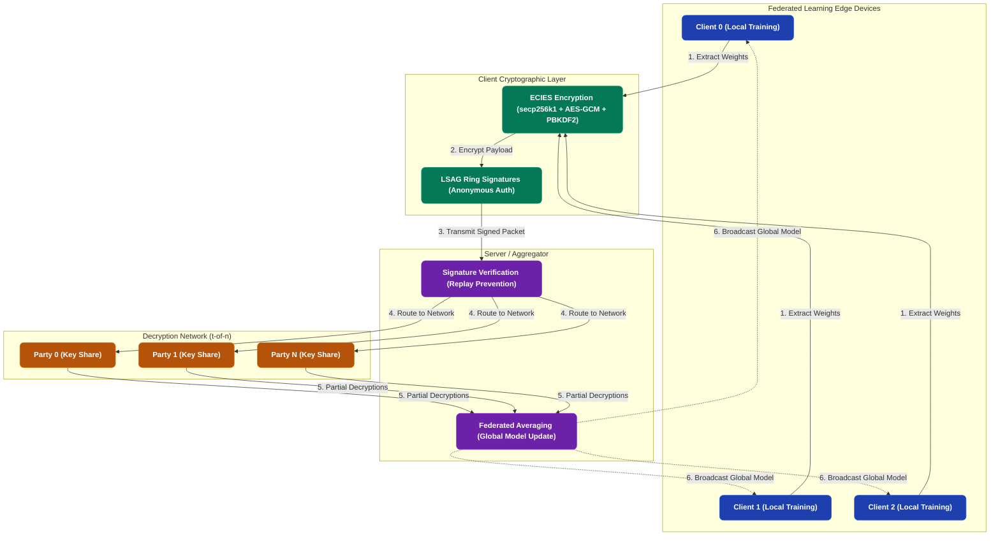

# Privacy-Preserving Federated Learning

> A production-grade research prototype implementing **privacy-preserving federated learning** by combining **threshold cryptography**, **ECIES encryption**, and **LSAG ring signatures** to ensure data confidentiality, anonymous authentication, and secure model aggregation.

---

## Problem Statement

Federated learning enables collaborative model training without sharing raw data. However, standard FL architectures remain vulnerable to three critical attack vectors:

1. **Model Update Inference Attacks**: An honest-but-curious server can extract sensitive information from plaintext gradients.
2. **Identity Tracking**: The server can correlate updates to specific clients across rounds, breaking anonymity.
3. **Single Point of Failure**: If the server's decryption key is compromised, all historical and future updates are exposed.

This project addresses all three threats simultaneously through a multi-layered cryptographic architecture.

---
## Video Walkthrough


https://github.com/user-attachments/assets/fd9f70b0-9353-4d5d-88ca-1062f656fa14


---
## System Architecture



---

## Security Properties

Our architecture guarantees the following security properties by design:

| Security Property | Mechanism |
|-------------------|-----------|
| **Data Confidentiality** | ECIES hybrid encryption (`secp256k1` ECDH + AES-256-GCM) secures the model payload. |
| **Key Derivation** | PBKDF2 with a random salt (100,000 iterations) defends against dictionary attacks. |
| **Distributed Trust** | Dealerless threshold key generation ensures no single party or trusted dealer holds the master private key. |
| **Anonymous Authentication** | LSAG (Linkable Spontaneous Anonymous Group) signatures conceal the signer's true identity within a group. |
| **Replay Prevention** | Cryptographic key images detect and prevent double-signing and replay attacks. |
| **Timing Safety** | Constant-time signature comparison using `secrets.compare_digest` mitigates side-channel timing attacks. |

---

## Project Structure

```text
threshold-fl/
├── crypto/                    # Core Cryptographic Primitives
│   ├── secp256k1.py           # Elliptic curve point operations
│   ├── threshold.py           # Dealerless DKG & threshold decryption
│   ├── encryption.py          # ECIES hybrid encryption (AES-GCM + PBKDF2)
│   └── lsag.py                # LSAG ring signature generation & verification
├── federated/                 # Federated Learning Implementation
│   ├── model.py               # Logistic regression model
│   ├── client.py              # FL client: train, encrypt, sign
│   └── coordinator.py         # Server: verify, decrypt, aggregate
├── data/                      # Dataset Management
│   └── dataset_loader.py      # Data loading and client partitioning
├── demo/                      # Interactive UI Dashboard
│   ├── app.py                 # Streamlit entry point
│   ├── renderers.py           # UI component renderers
│   └── styles.py              # CSS styling
├── scripts/                   # CLI Tools
│   └── run_simulation.py      # Headless simulation orchestration
└── config/
    └── config.yaml            # Global simulation parameters
```

---

## Quick Start

### 1. Environment Setup

Create and activate a Python virtual environment:

```bash
# Clone and enter directory
cd threshold-fl
python -m venv venv

# Windows
venv\Scripts\activate

# macOS / Linux
source venv/bin/activate
```

### 2. Install Dependencies

```bash
pip install -r requirements.txt
```

### 3. Launch the Interactive Dashboard

Experience the full simulation, step-by-step cryptographic processes, and live mathematical execution via the Streamlit dashboard:

```bash
streamlit run demo/app.py
```

### 4. Run Headless Simulation (CLI)

Alternatively, run the simulation in the terminal:

```bash
python scripts/run_simulation.py
```

---

## Configuration

Control the simulation parameters by editing `config/config.yaml`:

```yaml
num_clients: 3        # Total federated learning clients
num_parties: 5        # Total threshold decryption parties (n)
threshold: 3          # Minimum parties required to decrypt (t)
rounds: 2             # Total federated training rounds
learning_rate: 0.1    # Gradient descent learning rate
local_epochs: 10      # Training epochs per client per round
random_seed: 42       # Random seed for reproducibility
test_size: 0.2        # Train/test partition ratio
dataset_path: "filtered_diabetes_data (2).csv"
```

---

## License

This repository is provided as a research prototype for academic and educational purposes.
